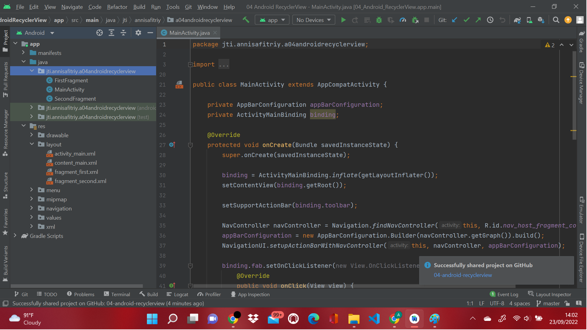

# Praktikum 4 : 04-android-recyclerview
    Nama  : Annisa Fitri Yuliandra
    Kelas : TI 3B
    Absen : 09
    NIM   : 2041720123
  Praktikum ini dilakukan dengan mengikuti petunjuk dari website : https://developer.android.com/codelabs/android-training-create-recycler-view#2
# Buat Projek dan Dataset
## 1.1 membuat projek dan layout
1. Memulai Android Studio.
2. Membuat projek baru dengan nama 04 Android RecyclerView, pilih **Basic Activity**, dan generate layout.

3. Jalankan Aplikasi.

## 1.2 Menambhkan kode untuk membuat data
1. Masukkan kode di MainActivity :

2. Masukkan fungsi di fungsi onCreate()

## 1.3 Ubah FAB icon
1. Masuk ke folder RES, klik kanan drawable

2. Pilih New > Image Set

3. Pilih Action Bar and Tab Items pada dropdown atas

4. Rename field

5. Pilih clip art yang diinginkan

6. Pilih HOLO

7. Klik Selesai

# Membuat RecyclerView
## 2.1 Mengubah layout di content_main.xml

