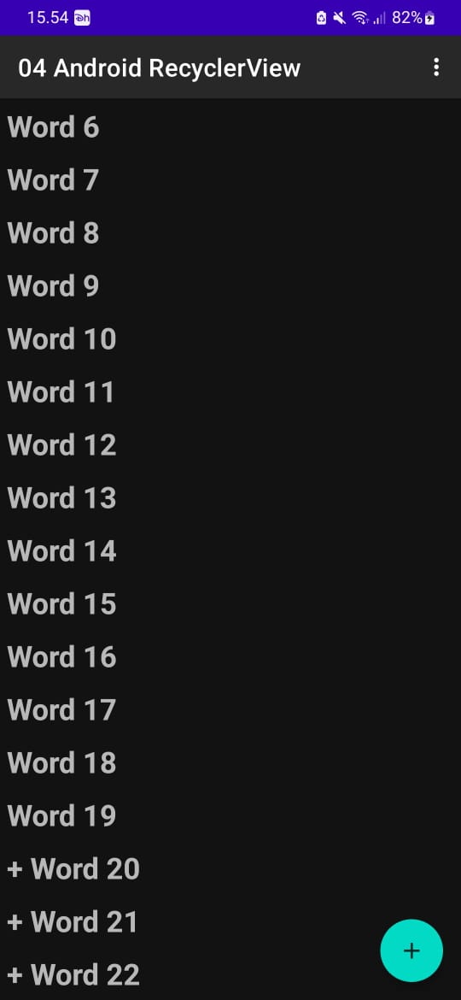

# Praktikum 4 : 04-android-recyclerview
    Nama  : Annisa Fitri Yuliandra
    Kelas : TI 3B
    Absen : 09
    NIM   : 2041720123
  Praktikum ini dilakukan dengan mengikuti petunjuk dari website : https://developer.android.com/codelabs/android-training-create-recycler-view#2
# Buat Projek dan Dataset

# Membuat RecyclerView

# Challenge

# Fix Challenge 1

# Challenge 1

# Homework

